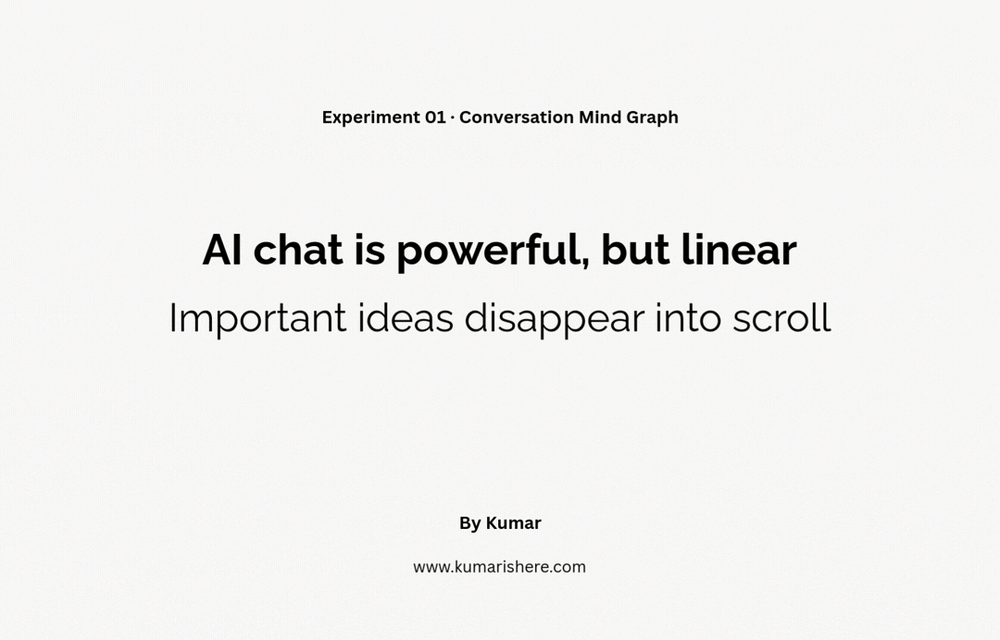

# Mindflow Experiemnt-01

**Chat with AI and watch your ideas build into a mind map in real time.**

---

## What it does

Type any question or idea. The AI answers and simultaneously builds a visual map of concepts on the left. Keep exploring — related questions attach to existing branches, unrelated ones start fresh. Click any node on the map to highlight the exact passage in the chat it came from.

## Live Demo

👉 **[Try it here](https://kumarabhishek99-ux.github.io/mindflow)**

> Bring your own Anthropic API key — it stays in your browser, never sent to any server.

---

## How to use

1. Get a free API key at [console.anthropic.com](https://console.anthropic.com/settings/keys)
2. Open the app, paste your key, start thinking

---

## Features

- 🗺 **Live mind map** — builds itself as you chat
- 🔗 **Smart branching** — related questions cluster, new topics start fresh
- 🔍 **Passage highlighting** — click a node to see exactly which sentence it came from
- ⚡ **Single file** — no install, no build step, no backend

## Stack

Vanilla HTML/CSS/JS · [Anthropic Claude API](https://www.anthropic.com)

---

## License

GPL v3 — free to use and modify, but derivatives must also be open source.
